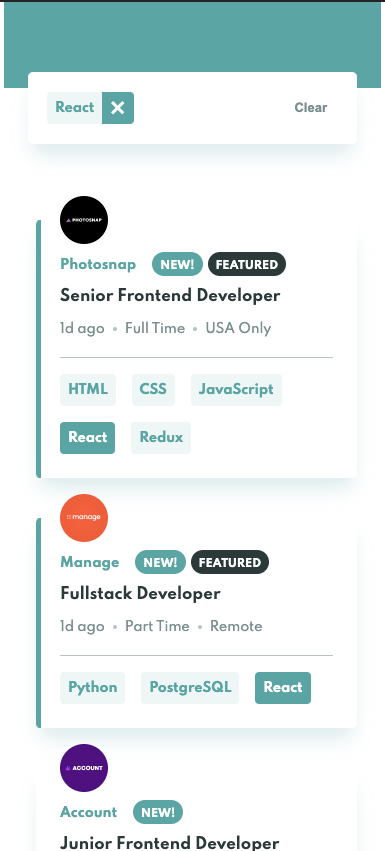

# Job listings with filtering (React, hooks, Context API)


## Table of contents

- [Job listings with filtering (React, hooks, Context API)](#job-listings-with-filtering-react-hooks-context-api)
  - [Table of contents](#table-of-contents)
  - [Overview](#overview)
    - [Goal](#goal)
    - [Screenshot](#screenshot)
    - [Links](#links)
  - [My process](#my-process)
    - [Built with](#built-with)
    - [Solution approach](#solution-approach)
      - [Custom hooks](#custom-hooks)
    - [Useful resources](#useful-resources)
    - [Continued development](#continued-development)
  - [Author](#author)

## Overview

### Goal

What I wanted to achieve from this

- practice some CSS skills and make an optimal layout for site which works on different screen sizes (with mobile first workflow)
- design hover states for all interactive elements on the page
- Filter job listings based on the categories or tech-skills
- apply React Context API for managing jobs data & filtering state

### Screenshot




### Links

- Live Site URL: [https://deep-jobs.surge.sh](https://deep-jobs.surge.sh)

## My process

### Built with

- Semantic HTML5 markup
- CSS custom properties
- Flexbox
- Mobile-first workflow
- [React](https://reactjs.org/) - JS library
- utilized [Context API](https://reactjs.org/docs/context.html) & created custom hooks.
- SCSS

### Solution approach

- Created custom Provider component (`JobsProvider`) which holds job related data
- `JobsProvider` saves us from [prop-drilling](https://beta.reactjs.org/learn/passing-data-deeply-with-context) & allows to share data across different parts of application component tree.
```jsx
// wrap your App inside JobsProvider
<JobsProvider>
  <App />
</JobsProvider>
```
#### Custom hooks
- I created a few custom hooks to keep state/actions logic separated & reusable in different components
- `useJobs()` - fetches jobs data & returns filtered jobs array
```jsx
const {jobs, isLoading} = useJobs()
```
  - `useFilters()` - returns currently applied filters & functions to add/remove/clearAll filter
```jsx
const {filters, isFilterApplied, addFilter, removeFilter, clearFilters} = useFilters()
```
  - `addFilter(skill)`, `removeFilter(skill)` - are just helper functions which `dispatch` appropriate action(s) under the hood

### Useful resources
- [Context API](https://beta.reactjs.org/apis#context)
- [Using React Context effectively](https://kentcdodds.com/blog/how-to-use-react-context-effectively) - This helped me structuring `<JobsProvider>` & designing custom-hooks. I really liked this pattern and will use it going forward.
- **NOTE:** I still feel [Redux Toolkit](https://redux-toolkit.js.org/) is much better for global state management in mid-size or big applications.

### Continued development
- I would like to use [styled-components](https://styled-components.com/) library for writing CSS-in-JS approach, would definitely try it.

## Author

- Profile - [Deepak Chandani](https://www.linkedin.com/in/deepak-chandani-66676727/)

